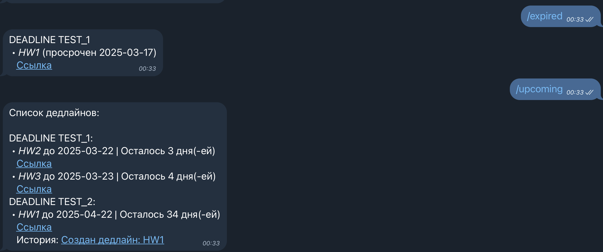

# Deadline Tracker Bot

Этот репозиторий содержит Telegram-бота для отслеживания дедлайнов из чатов и супергрупп. Бот мониторит важные сообщения в закрепленных топиках и собирает все дедлайны в один общий список (со ссылками на исходные сообщения). Он также отображает, какие дедлайны уже пропущены.

Бот может обновлять уже заданные дедлайны и показывать историю обновления дедлайнов




## Возможности
- Отслеживание топиков с дедлайнами в нескольких супергруппах Telegram.
- Автоматическое добавление дедлайнов в единый список.
- Подсветка пропущенных дедлайнов.
- Гибкая настройка отслеживаемых чатов и топиков.
- Возможность использования кастомной LLM (например, LLaMA 3.3 70B, развернутой в Yandex Cloud) для анализа сообщений.

## Установка и настройка

### 1. Установка зависимостей
Для работы бота требуется Python 3.13.2.
```sh
python3 -m venv venv
source venv/bin/activate  # Для Linux/Mac
pip install -r requirements.txt
```

### 2. Получение Telegram ID
Чтобы бот мог взаимодействовать с вами в Telegram, необходимо узнать свой Telegram ID. Сделать это можно через [@userinfobot](https://t.me/userinfobot).

### 3. Создание бота в BotFather
- Перейдите в Telegram и откройте [@BotFather](https://t.me/BotFather).
- Отправьте команду `/newbot` и следуйте инструкциям.
- Получите API-токен бота.
- Выдайте боту доступ на чтение сообщений в группах. # как это сделать разберитесь сами
- Добавьте бота в интересующие вас группы.

### 4. Узнать ID группы и топиков через запуск `echo_bot.py`

Для тестового запуска выполните команду:
```sh
python echo_bot.py
```
При отладке вам потребуется узнать ID группы и ID топика, чтобы корректно настроить `deadline_sum_bot.py`.

Этот бот будет пересылать сообщения из топиков супергрупп вам в личку с указанием ID группы и топика

### 5. Настройка конфигурации
Отредактируйте конфиг в `deadline_sum_bot.py`:

```python
from datetime import timedelta

config = {
    "time_offset": timedelta(days=0, hours=0, minutes=0), # нужен был для отладки
    "chats_and_topics": {
        -100.... : [2..., 3....],  # ID групп и топиков для отслеживания | ид супергруппы с минусом
    }
}
```

### 6. Настройка модели ИИ
Бот поддерживает интеграцию с AI-моделями (OPENAI API) для обработки сообщений. Например, можно использовать LLaMA 3.3 70B, развернутую в Яндекс Клауде.

> **Важно:** LLaMA 3.3 70B разработана компанией Meta, которая признана экстремистской организацией в РФ.

Для работы с AI вам потребуется:
- Токен API
- URL кастомного API (если используется не OpenAI, а, например, модели в Yandex Cloud)


### 7. Подготовить системные переменные
Создайте файл '.env' и пропишите там следующие переменные
- AI_KEY = ...
- AI_BASE_URL = ...
- AI_MODEL = ...
- TELEGRAM_BOT_TOKEN = ...

### 8. Запуск бота
Для тестового запуска выполните команду:
```sh
python deadline_sum_bot.py
```
Пропишите какие-нибудь дедлайны в топиках группы

Например:
```Внимание!

Дедлайн по HW1 устанавливаем на 21.03
```

В боте можете использовать 2 метода

- /upcoming - выведет дедлайны которые ещё актуальны
- /expired - выведет просроченные дедлайны


## Лицензия
Проект распространяется под свободной лицензией. Используйте на свой страх и риск.

## Контакты
Если у вас есть вопросы или предложения, создайте Issue или Pull Request в этом репозитории.

